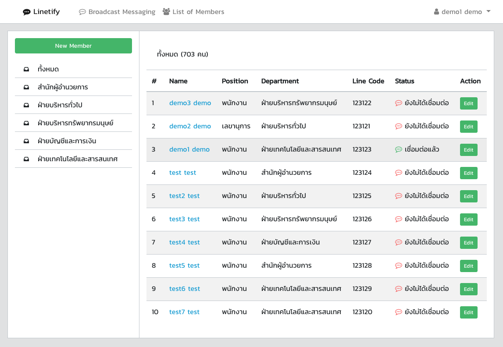
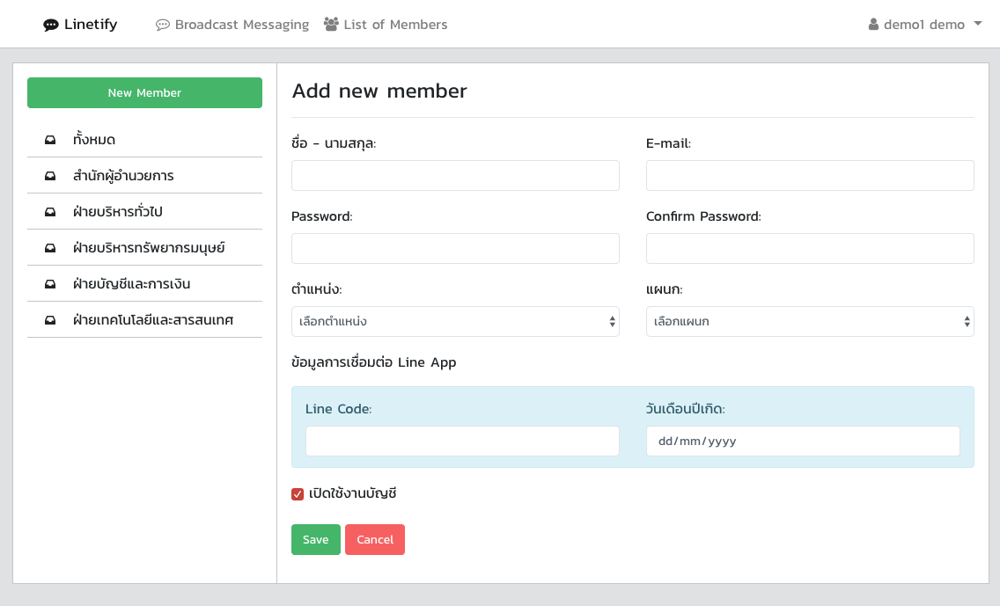

 

### About

Message Broadcast System (MBS) คือระบบส่งข้อความทาง Line ไปยังผู้ใช้ที่มี Line account แบบเฉพาะเจาะจง

ตัวอย่างการนำไปประยุกต์ใช้ในองค์กรของท่าน
* มีพนักงาน 600 คน 100 คนอยู่ในแผนก A บริษัทต้องการส่ง Line หาทุกคนในแผนก A
* มีพนักงาน 120 คนที่ยังไม่ตรวจสุขภาพ บริษัทต้องการส่ง Line เตือนพนักงานกลุ่มนี้ให้มาตรวจสุขภาพ
* บริษัทมีลูกค้า 500 คน แบ่งเป็น segment ต่าง ๆ ต้องการส่ง Promotion ทาง Line หาลูกค้าเพียงบางคนหรือบาง segment (โดยที่ลูกค้าอนุญาต)
* หากพัฒนาต่อยอด สามารถทำสิ่งอื่น ๆ ได้อีกมากมาย เช่น การให้พนักงานเช็ควันลาผ่านทาง Line, การสำรวจความเห็น, ฯลฯ

ที่มาเป็น project นี้ มาจากโจทย์ที่ว่าปัจจุบันพนักงานส่วนใหญ่ขององค์กรนั้นมี Line account กันอยู่แล้ว แต่ทีม management ไม่มีวิธีการจะสื่อสารไปยังพนักงานแต่ละคนอย่างเฉพาะเจาะจงได้

* หากใช้วิธีสร้างกรุ๊ป Line ขึ้นมา เราจะแน่ใจได้อย่างไรว่าคนที่อยู่ในกรุ๊ปยังเป็นพนักงานขององค์กรอยู่ ต้องมีการมอบหมายให้ผู้รับผิดชอบคอยตรวจสอบสมาชิกในกรุ๊ป เมื่อมีคนลาออกก็มา kick ผู้ใช้นั้น ๆ ออกจากห้อง
* หรือมีคนเข้าใหม่ก็ต้องมาแอดเข้ากรุ๊ป ซึ่งผู้ที่จะทำหน้าที่แอดเข้าก็ต้องเป็นเพื่อนกับทุกคนในองค์กร ซึ่งพนักงานบางส่วนอาจไม่สบายใจที่จะทำเช่นนั้น เนื่องจากเป็น account Line ส่วนตัว
* หรือหากต้องการส่งข้อความหาพนักงานอย่างเฉพาะเจาะจง ก็ต้องสร้างกรุ๊ปย่อยที่มีผู้ที่ต้องการรับอยู่ในนั้นทีละกรุ๊ป ซึ่งไม่สะดวกเช่นกัน

เราจึงสร้างระบบนี้ขึ้นมา เพื่อเป็นเครื่องมือในการสื่อสารที่แก้ปัญหาดังกล่าว

**วิธีการใช้**
1. ให้พนักงานทุกคนเพิ่ม Line Official Account ที่เราสร้างขึ้นเป็นเพื่อน
2. ให้พนักงานยืนยันตัวตนโดยเปรียบเทียบกับข้อมูลลับ เช่น นาย ก. ทราบว่ารหัสคือ AAA เมื่อผู้ใช้บอกกับ chatbot ว่าตนเองคือนาย ก. พร้อมแจ้งรหัส AAA ระบบก็จะบันทึกไว้ว่า Line account นั้นเป็นของนาย ก. จริง
3. หลังจากนั้นผู้ใช้งานระบบ MBS ก็จะสามารถส่งข้อความถึงนาย ก. ได้

Project นี้เป็น project ที่เราพัฒนาขึ้นใช้กันภายในองค์กร แต่ทางทีมเห็นว่าน่าจะเป็นประโยชน์ต่อสังคมเช่นกัน จึงได้แบ่ง feature บางส่วนออกมาเป็น project open-source นี้และเผยแพร่ต่อสังคม

### Features

* ส่งข้อความ Broadcast ผ่านทาง Line ไปได้หลายคน อย่างเฉพาะเจาะจง
* รองรับข้อความประเภท ข้อความ รูปภาพ วิดีโอ
* ผู้ใช้งานที่ เพิ่มเพื่อน และยืนยันตัวตนด้วย Code + วดป. เกิด แล้วเท่านั้น จึงจะสามารถรับข้อความ Broadcast ได้
* สามารถสร้างกลุ่มสำหรับผู้รับข้อความ เช่น กลุ่มตามโครงสร้างองค์กร, กลุ่มเฉพาะกิจ
* สามารถเพิ่มผู้ใช้งานกลุ่มพิเศษ (ที่ไม่มี วดป. เกิด) เช่น Line ID ของหน่วยงาน หรือแผนกต่าง ๆ ภายในองค์กร
* ระบบจัดการผู้ใช้งานงานเบื้องต้น โดยสามารถ เพิ่ม แก้ไข ยกเลิกการผูก Line ID กับผู้ใช้งาน

### System Requirements

- Linux OS หรือ Windows server (ติดตั้ง ffmpeg package หากต้องการส่งข้อความประเภทวิดีโอ)
- MySQL 5.7+ หรือ MariaDB 10.2+
- Nginx หรือ Apache Server
- Git และ Composer
- PHP >= 7.1.3
- BCMath PHP Extension
- Ctype PHP Extension
- JSON PHP Extension
- Mbstring PHP Extension
- OpenSSL PHP Extension
- PDO PHP Extension
- Tokenizer PHP Extension
- XML PHP Extension

### Installation

กรณีติดตั้งอัตโนมัติด้วย Docker

1.  Git clone ระบบเพื่อสร้างโปรเจค

```bash
$ git clone https://github.com/rph-dev/mbs
```

2.  ตั้งค่า Docker path โดยที่ไฟล์ ./docker/start.sh ให้กำหนด folder path ที่อยู่โปรเจคให้ถูกต้อง

    2.1 Container php-fpm
    
    ```bash
    -v /your_folder_path/mbs:/var/www/mbs-web
    -v /your_folder_path/mbs/docker/php-fpm/php-ini-overrides.ini:/usr/local/etc/php/conf.d/99-overrides.ini:ro
    ```
    2.2 Container webserver
    ```bash
    -v /your_folder_path/mbs:/var/www/mbs-web
    -v /your_folder_path/mbs/docker/nginx/site/mbs.web.conf:/etc/nginx/conf.d/mbs.web.conf:ro
    ```

3. สร้าง Docker Container

```bash
$ cd /your_folder_path/mbs
$ chmod -R +x ./docker
$ cd docker
$ ./create.sh
```

4.  ตั้งค่าไฟล์ .env ของ Laravel

    4.1 ตั้งค่า URL และส่วนอื่น ๆ (หากต้องการ)
    
    ```bash
    APP_NAME="Linetify"
    APP_ENV=local
    APP_DEBUG=true
    APP_URL=http://localhost
    ```

    4.2 ตั้งค่า Line Token (สามารถสมัครเพื่อขอรับ Token key ได้ที่ https://developers.line.biz)
    ```bash
    LINE_MBS_CHANNEL_ACCESS_TOKEN="xxx"
    LINE_MBS_CHANNEL_SECRET="xxx"
    ```

5.  การติดตั้ง

    5.1 เรียกคำสั่งติดตั้ง
    ```bash
    $ ./install.sh
    ```

    5.2 เข้าใช้งานผ่าน
    
    User สำหรับทดสอบ\
    username: demo@email.com\
    password: demo
    
    ```bash
    http://127.0.0.1:8088
    ```

6.  การตั้งค่าอื่น ๆ

    6.1 กรณีต้องการ Stop service
    
    ```bash
    $ ./stop.sh
    ```

    6.2 กรณีต้องการ Start service
    
    ```bash
    $ ./start.sh
    ```

    6.3 กรณีต้องการลบ Docker Container
    
    ```bash
    $ ./remove.sh
    ```

    6.4 กรณีต้องการลบข้อมูลทั้งหมด
    
    ```bash
    $ ./remove-data.sh
    ```

7.  การแก้ปัญหาการติดตั้งไม่สำเร็จเบื้องต้น
-   ตรวจสอบว่าภายในระบบได้ติดตั้ง Docker แล้วหรือยังด้วยคำสั่ง เช่น
    ```bash
    $ docker -v
    Docker version 19.03.2, build 6a30dfc
    ```
-   กรณีต้องการติดตั้งระบบใหม่ทั้งหมด
    ```bash
    $ git pull # สำหรับ pull อัพเดท source code
    $ #git stash # สำหรับใช้แก้ปัญหาถ้าหาก git pull ไม่ได้เนื่องจากไฟล์ภายในโปรเจคได้มีการแก้ไข และ source code รวมทับไฟล์ที่แก้ไขไม่ได้
    # กรณีรันคำสั่ง git stash ต้องตั้งค่า Docker path ใหม่ในหัวข้อ Installation ข้อที่ 2
    
    $ cd docker
    $ ./remove-data.sh
    $ ./create.sh
    $ ./install.sh
    ```
-   กรณี port 3306 ของ Container mbs-mariadb ชนกับ port อื่น ๆ ที่อยู่ภายในเครื่องสามารถแก้ไขได้ดังนี้
    ```text
    - แก้ไขการตั้งค่าที่ไฟล์ ./docker/start.sh (Container mbs-mariadb)
    - สามารถลบออกบรรทัดนี้ออก -p 3306:3306 \ หรือเปลี่ยน port ใหม่เช่น -p 3309:3306
    - สั่งเริ่ม Container ใหม่ด้วยคำสั่ง $ ./start.sh
    ```
-   กรณีต้องการเปลี่ยน port 8088 ของ Container mbs-webserver สามารถแก้ไขได้ดังนี้
    ```text
    - แก้ไขการตั้งค่าที่ไฟล์ ./docker/start.sh (Container mbs-webserver)
    - เปลี่ยน port ใหม่เช่น -p 80:8000
    - สั่งเริ่ม Container ใหม่ด้วยคำสั่ง $ ./start.sh
    ```
-   กรณีใช้งานใน Production mode (สำหรับใช้งานจริง)
    ```text
    - ต้องตั้งค่า SSL โดยสำหรับ Nginx ต้อง Mapping port เพิ่มเติมเช่น -p 443:443
    - สามารถใช้ Database ระบบเดิมได้ (หากมีอยู่แล้ว)
    - กำหนดค่าไฟล์ .env ของ Laravel เช่น APP_DEBUG=false APP_ENV=production APP_URL=https://your_real_url
    - ข้อมูลเพิ่มเติมสำหรับการ Deployment ของ Laravel https://laravel.com/docs/5.8/deployment
    ```
    
### Line Webhook (Development)

1.  ตั้งค่า SSH tunnel (SSH port forwarding) สำหรับ SSL
```bash
$ ssh -R rph-line-bot:443:127.0.0.1:8088 serveo.net
```
ซึ่งจะได้ URL ตามตัวอย่างนี้ https://rph-line-bot.serveo.net

2.  โดยระบบได้กำหนด Route ของ Webhook URL ไว้เป็น /api/line-bot/callback ดังนั้นจะได้ URL ตัวอย่างเช่น https://rph-line-bot.serveo.net/api/line-bot/callback

*แนะนำให้ใช้ Webhook URL นี้สำหรับการทดสอบเท่านั้น โดยท่านสามารถนำ URL นี้ไปใช้ตั้งค่าสำหรับ Webhook Line Event ที่ https://developers.line.biz

### Upgrading

สามารถรันคำสั่งนี้เมื่อต้องการ Update ระบบ
```bash
$ ./update.sh
```

### Bug Reports & Feature Requests

หากพบข้อผิดพาด (Programming bug) หรือคุณสมบัติอื่น ๆ ที่อยากเพิ่มเติมในอนาคต สามารถรายงานได้ที่ [GitHub Issues](https://github.com/rph-dev/mbs/issues)

### Contributing

ระบบ Message Broadcast System (MBS) พัฒนาด้วย Laravel Framework 5.8 และ Vue.js หากท่านมองเห็นว่ามี Code ส่วนใดเหมาะสมที่ควรแก้ไข หรือปรับปรุงเพิ่มประสิทธิภาพให้ดีขึ้น ท่านสามารถ Fork โปรเจคนี้เพื่อร่วมพัฒนาที่ Branch Develop หรือสามารถแยก Branch เองได้ตามต้องการจากนั้นท่านสามารถส่ง Pull Requests เข้ามาได้ทุกเมื่อ

### Security Vulnerabilities

หากคุณค้นพบช่องโหว่ด้านความปลอดภัยภายใน Message Broadcast System (MBS) โปรดส่งอีเมลไปที่ Kongvut Sangkla ผ่านทาง [kongvut.s@rph.co.th](mailto:kongvut.s@rph.co.th) ช่องโหว่ความปลอดภัยทั้งหมดจะได้รับการแก้ไขทันที

### Credits

ฝ่ายเทคโนโลยีสารสนเทศ โรงพยาบาลราชพฤกษ์ Ratchaphruek Hospital Public Company Limited (RPH), Thailand

### License

The Message Broadcast System (MBS) is open-source software licensed under the [MIT license](https://opensource.org/licenses/MIT).
